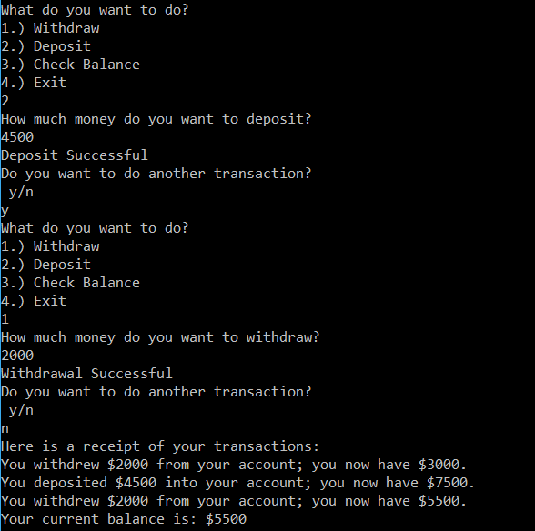

# Lab02-Unit-Testing

# Description
This is an application that simulates an ATM machine through a console application.  
The 4 actions that can be done are:  
1. Withdraw
2. Deposit
3. Check Balance
4. Exit

# Visual
Here's a screenshot of the application:  
;

# Implementation
1. Download Visual Studio
2. Clone the repo Lab02-Unit-Testing
3. Open Lab02-Unit-Testing.sln in Visual Studio
4. In the Debug menu; click on the "Start without Debugging" option (or CTRL + F5)

# Resources
I used these resources to complete this application:  
Amanda's lecture  
["Queue<T>"](https://msdn.microsoft.com/en-us/library/t249c2y7(v=vs.110).aspx)  
[Fish](http://www.ascii-art.de/ascii/def/fish.txt)
